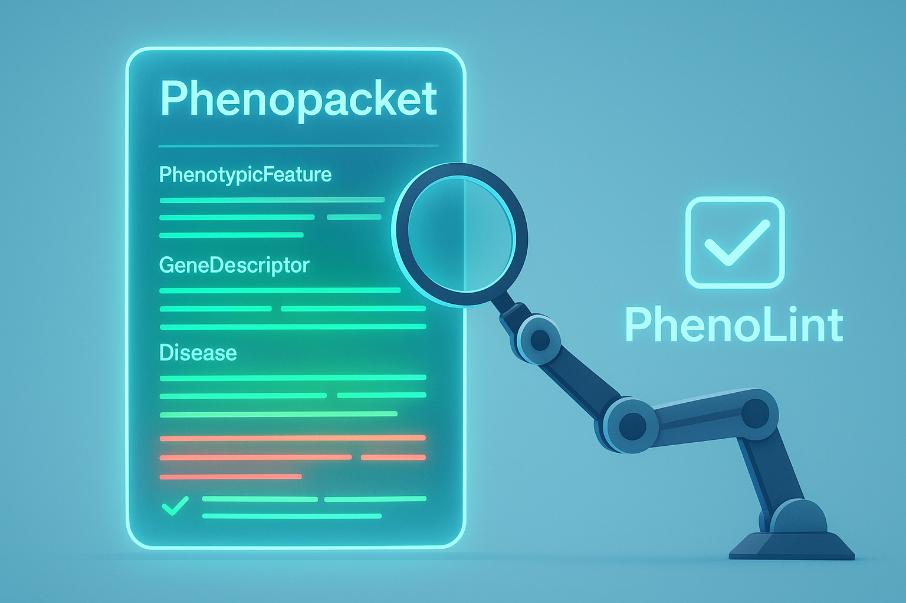

# Phenolint  [![License: MIT][license-badge]][license]

[license]: https://opensource.org/licenses/MIT

[license-badge]: https://img.shields.io/badge/License-MIT-blue.svg

### Click -> [How to implement a Rule](src/rules/readme.md)

